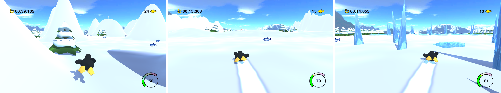

  

# Tux Racer Go

   

Tux Racer Go is a [Tux Racer](https://en.wikipedia.org/wiki/Tux_Racer) clone/remake which utilizes endless runner type of gameplay. You can try it out yourself by downloading [the latest version](https://github.com/matijakljajic/tuxracergo/releases/latest). Try to collect as many herring as you can before you bump into a tree or an icicle.

## Controls

You can:
- Press `W` to _speed up_
- Press `A` to _turn left_
- Press `S` to _slow down_
- Press `D` to _turn right_
- Press `E` to _jump_ (you need to hold it for a higher jump)
- Press `ESC` to _pause and open a correlated menu_

## Screenshots

## Credits

Music from the original open-source game can be found here, music is composed by:
- Joseph Toscano: <scarjt@pcom.net>
- K. Schroeder: <kschroeder@mirageworks.com>

## License

Code found in this repository is licensed under [GPLv3](LICENSE).
